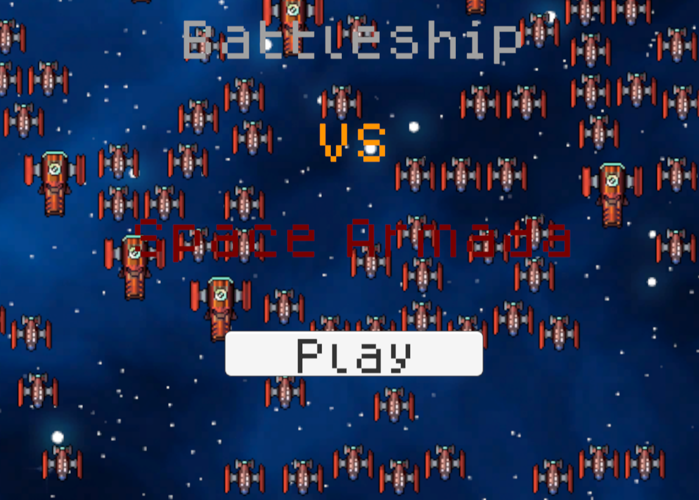

# Rosaure ECS

-Custom ECS written in C# for Unity 
-[Original repo with the full Unity Project](https://github.com/BarbasOyun/ClassShmup) 
-WIP 
-Next Performance Update : Use GPU Instancing + Custom physic to replace Unity's GameObjects 

## What's an ECS?

-[ECS](https://en.wikipedia.org/wiki/Entity_component_system) stands for Entity Component System 
-Allow to manage a lot of Entities in a Simulation 
-e.g. Enemies & Projectiles in a Game 

## Goals

-Max performance 
-Engine agnostic 
-Modularity 

## Features

-Base ECS that can be implemented by other Systems 
-Sub Array 
-Define Entity Types per System implementing Rosaure (e.g. Enemy1, Enemy2) 
-Custom data per Entity Type 
-Custom behaviors/logic per Entity Type 

## Battleship Vs Space Armada

-[On Itch.io](https://barbasdev.itch.io/battleship-vs-space-armada) 
-[Gihub pages Web Version](https://barbasoyun.github.io/Rosaure-ECS/) 
-Technical Demo game for Rosaure ECS 
-Implement Rosaure in EnemyManager and ProjectileManager 
 
 